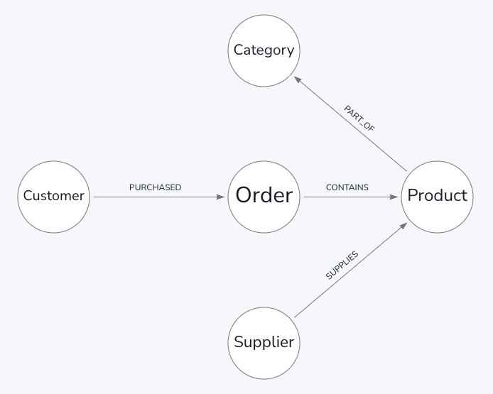
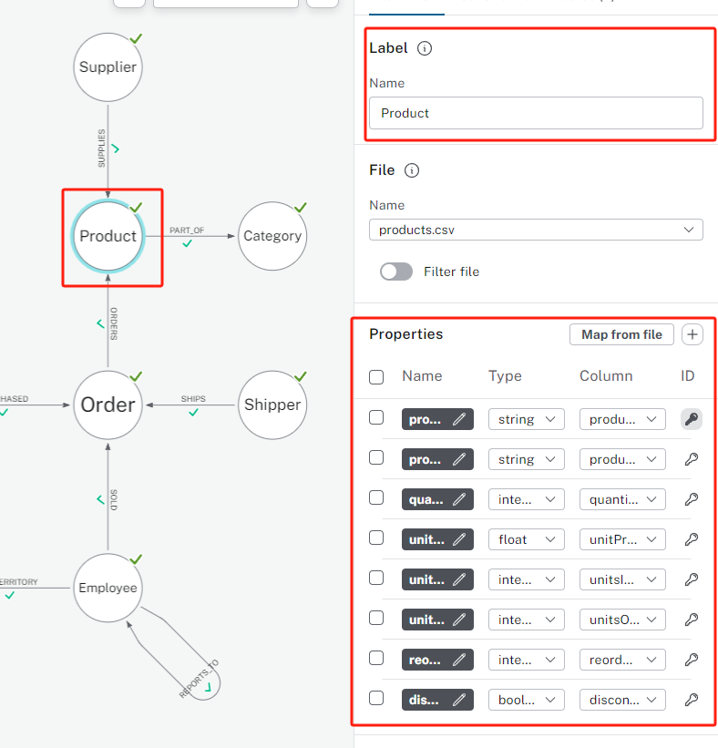
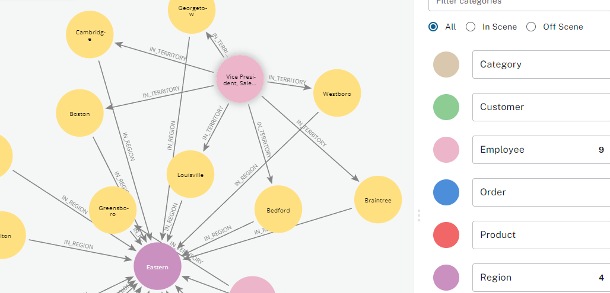
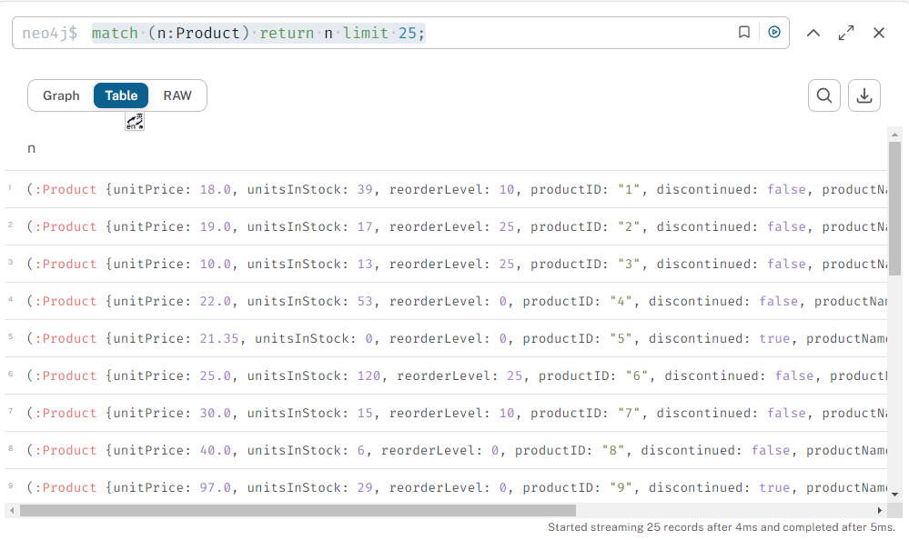
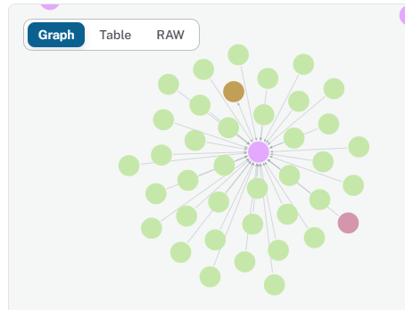
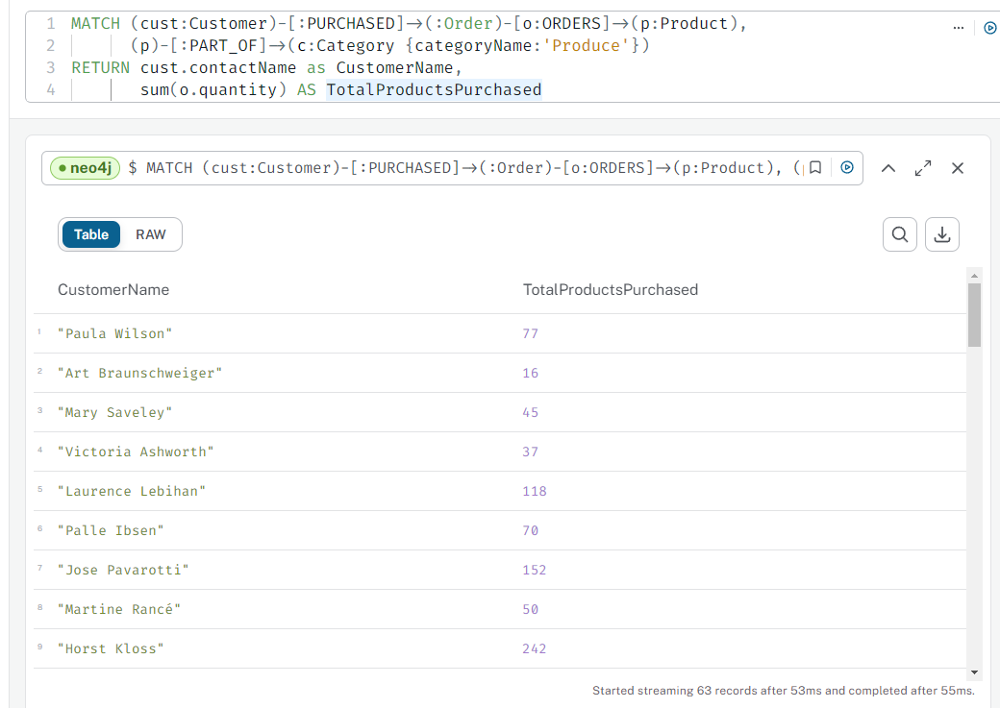

学习Neo4j的笔记，通过在线课程[入门 欢迎来到 Neo4j](https://neo4j.com/docs/getting-started/ "Neo4j Cypher文档") 进行学习。

# Neo4j是什么

使用免费版云Neo4j Aura DB：[Start Free](https://neo4j.com/cloud/platform/aura-graph-database/?ref=nav-get-started-cta)

> Neo4j是一个可以存储节点（nodes）和它们之间的关系（relationships）的图数据库。
>
> 在关系数据库中，通常需要在查询中添加显式连接。在此过程中，需要在查询语句的运行时才会计算关系，这可能是一项昂贵而缓慢的操作。
> 在图（graph）中，关系直接被存储，许多强大的操作都更快更简单。



# 节点、属性和关系(Node, properties, relationships)

**节点**和**关系**都可以有类型（type）和属性（properties）。

## 节点

> *节点*可以使用：labels标签 进行标记（例如Supplier，employee）也可以使用key-value对 进行标记（name : "Minato"）（我的理解是类似对象



这里可以看出，节点拥有Label作为**节点标识**，同时拥有一系列properties。

## 关系

> *关系*对两个节点提供方向、类型化或归属性的连接。（e.g.Shipper SHIPS Order）
>
> 关系拥有确定的方向、类型、开始节点、结束节点和属性（可选）
>
> 节点可以有任意数量的关系，且性能不会受到影响。
>
> 开始节点和结束节点可以相同


这里可以看出，关系拥有Label作为**关系标识**，拥有开始节点（from）和结束节点（to），拥有属性（可有可不有）

# 导入数据

构建完图结构后，可以将数据进行导入。

每个节点、关系都对应了一张csv表格。例如，Customer节点对应的 `customer.csv`的每一行就代表了一个顾客。

再比如，这里的product有多个关系，`SUPPLIES`和 `PART_OF`，分别连接 `Supplier`和 `Category`。


但这两个关系都根据 `product.csv`进行构建


在 `product.csv`中记录了Supplier和Category的id


导入的Cypher语句示例（自动生成的，后面再专门对Cypher进行学习）

## Key statement

```
CREATECONSTRAINT`territoryID_Territory_uniq` IF NOTEXISTS
FOR(n:`Territory`)
REQUIRE(n.`territoryID`)ISUNIQUE;
```

## Load statement

```
UNWIND$nodeRecordsAS nodeRecord
WITH*
WHERENOT nodeRecord.`territoryID`IN$idsToSkipANDNOT nodeRecord.`territoryID`ISNULL
MERGE(n:`Territory`{`territoryID`: nodeRecord.`territoryID`})
SET n.`territoryDescription`= nodeRecord.`territoryDescription`;
```

Explore the graph 探索图

导入数据之后，是将真实数据集以图的形式展示出来。可以在搜索框中使用 `Show me a graph`进行自动的展示部分图。



可以在输入框输入节点的label来预览该节点的所有数据。也可以全选之后右键选择*Expand → All*来预览与他相关的所有关系和节点。

# Querying 查询

## 简单查询1

查询25个product，可以写下面的语句也可以直接点击节点生成。

```
match (n:Product) return n limit 25;
```




双击node可以看到他的neighbor（或者右键expand）



## 简单查询2

查找 有节点(n:Product)，关系[r:SUPPLIES]和节点(s:Supplier) 的图

```
MATCH (n:Product)<-[r:SUPPLIES]-(s:Supplier)
RETURN n,r,s
LIMIT 25
```


## 简单查询3

该查询可以找到来自公司Blauer See Delikatessen的客户订购的所有产品以及谁提供了这些产品。

```
MATCH path=(c:Customer)-[:PURCHASED]->()-[:ORDERS]->(:Product)<-[:SUPPLIES]-(:Supplier)
WHERE c.companyName = 'Blauer See Delikatessen'
RETURN path;
```


## 简单查询4

查询购买了categoryName为Produce的Product的Customer的名字和其订单的总quantity

```
MATCH (cust:Customer)-[:PURCHASED]->(:Order)-[o:ORDERS]->(p:Product),
      (p)-[:PART_OF]->(c:Category {categoryName:'Produce'})
RETURN cust.contactName as CustomerName,
       sum(o.quantity) AS TotalProductsPurchased
```



# 总结

学习了Neo4j的基本概念，基础操作。以及一些简单的Cypher语句。

接下来会继续学习[Neo4j的免费课程](https://graphacademy.neo4j.com/categories/beginners/)。应该先学习[Cypher的基础](https://neo4j.com/docs/cypher-cheat-sheet/5/auradb-enterprise/)。
