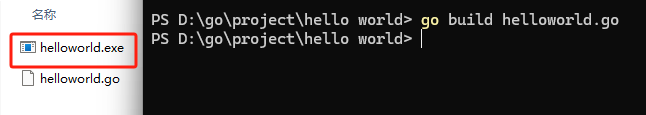

从Go语言圣经开始学习

# Hello World

最简单的环节

```go
package main
import "fmt"

func main(){
	fmt.Println("Hello, world~~")
}
```

然后运行（懒人直接用VsCode

```shell
$ go run helloworld.go`
```

输出

> Hello, world~~

## 自己build

使用指令

```shell
$ go build helloworld.go
```



直接生成exe 哇哦 真神奇

然后直接调用

```powershell
PS D:\go\project\hello world> ./helloworld
Hello, world~~
```

## 基本要点理解

- **package：**	和java的package一样，标识这个文件属于哪个包的。而且package main和其他package 地位不一样，类似于main函数
- **import：**		也类似于java，引用其他包用的
- **声明函数：**	使用 func、函数名、参数列表、返回值列表

> go语言不需要写分号，也不能随意换行，例如函数的左括号 **{** 必须和 func函数声明在同一行上,
> 且位于末尾，不能独占一行，而在表达式 x+y中，可在 +后换行，不能在 +前换行

## init mod

感觉是类似conda的东西，`go mod init Name`创建 `go mod tidy` 移除不需要的并添加需要的

```powershell
PS D:\go\project\hello world> go mod init Helloworld
go: creating new go.mod: module Helloworld
go: to add module requirements and sums:
        go mod tidy
PS D:\go\project\hello world> go mod tidy
PS D:\go\project\hello world>
```

## 相关工具

- **gofmt：** 格式化代码
- **goimports：** 自动添加或删除import
